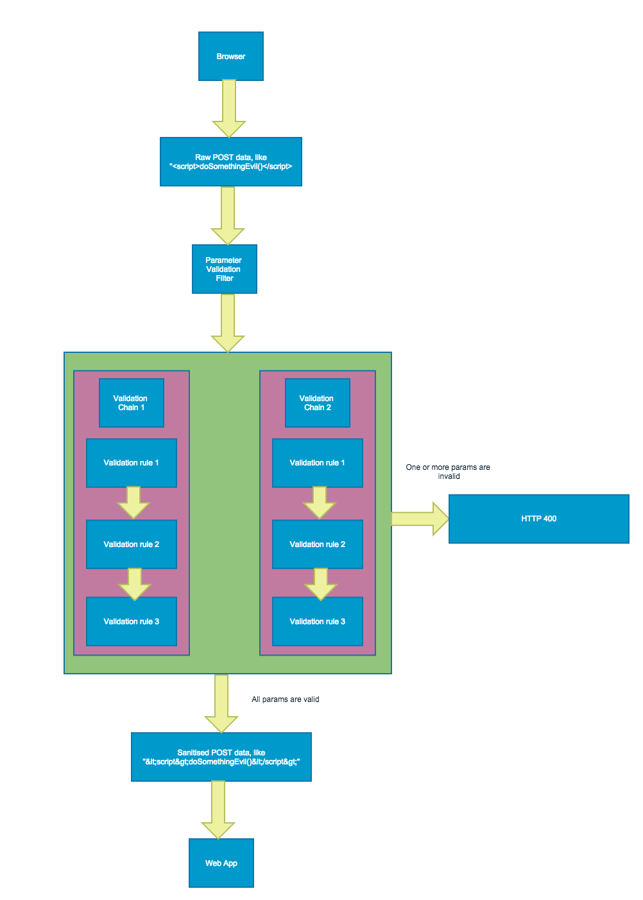

[](https://github.com/dalet-oss/parameter-validation-filter/actions/workflows/ci-build.yml) [](https://maven-badges.herokuapp.com/maven-central/com.github.dalet-oss/parameter-validation-filter) [](https://github.com/dalet-oss/parameter-validation-filter/blob/master/LICENSE)
---

## Introduction

The Parameter Validation Filter (PVF) is a Java library containing a class that implements a Servlet Filter. When this
class is configured in the web.xml file of a web application, it can be used to validate and sanitise parameter
properties being sent to the application.

This library is based off the idea discussed on the OWASP website at https://www.owasp.org/index.php/How_to_add_validation_logic_to_HttpServletRequest.

You can find a write-up of this library at http://java.dzone.com/articles/xss-filter-java-ee-web-apps.

## Origins

The code in this repo was originally derived from https://github.com/mcasperson/ParameterValidationFilter.  That repo is clearly no longer
being maintained (at the time of writing, no changes in 5 years, no issue page available, and contributed PRs have been
ignored).

We have made a number of changes and continue to develop this repo.  To simplify processes such as PRs etc, we now
maintain this not as a fork of the original project but as a project in its own right.


## Builds, releases etc.

This project is built using Github Actions.

-  All pushes to the `master` branch trigger the [](https://github.com/dalet-oss/parameter-validation-filter/actions/workflows/ci-build.yml)
   workflow.
-  All pushes of Git tags matching `release/*` trigger the [](https://github.com/dalet-oss/parameter-validation-filter/actions/workflows/ci-publish.yml)
   workflow.

Published artifacts are available on Maven Central as `com.github.dalet-oss:parameter-validation-filter`.

For the latest version, see https://github.com/dalet-oss/parameter-validation-filter/tags.

#### Note for maintainers:

-  Every push to master gets built, but not published
-  To publish artifacts, it is necessary to specify a version number by adding an appropriate Git tag to `HEAD` with an
   appropriate prefix.  For example, tagging HEAD with `release/1.3.8` will cause version `1.3.8` to be published on
   the next build.


## How to Use

Add the following to web.xml:

```xml
	<filter>
		<filter-name>ParameterValidationFilter</filter-name>
		<filter-class>com.matthewcasperson.validation.filter.ParameterValidationFilter</filter-class>
		<init-param>
			<param-name>configFile</param-name>
			<param-value>/WEB-INF/xml/pvf.xml</param-value>
		</init-param>
	</filter>
	<filter-mapping>
		<filter-name>ParameterValidationFilter</filter-name>
		<url-pattern>*.jsp</url-pattern>
	</filter-mapping>
```

Create a file called WEB-INF/xml/pvf.xml with the following contents:

```xml
<?xml version="1.0" encoding="UTF-8" standalone="yes"?>
<!-- ParameterValidationChainDatabase is always the document element -->
<ParameterValidationChainDatabase>
    <!--
    Enforcing mode needs to be set to true to return a HTTP error code if validation fails.
    If set to false, validation errors are logged but ignored.
    -->
    <EnforcingMode>true</EnforcingMode>
    <!-- We always have a single ParameterValidationChains element under the parent -->
    <ParameterValidationChains>
    	
    	<!-- Each chain of validation rules is contained in a ParameterValidationDefinition element -->
    	<!-- 
    		This chain apply some global validation rules. If anyone supplies encoded or params with HTML
    		characters, it will fail.
    	 -->
        <ParameterValidationDefinition>
        	<!-- This is the list of validation classes that should be applied to matching parameters -->
            <ParameterValidationRuleList>
                <ParameterValidationRule>
                	<!-- This is the fully qualified name of the class used to apply the validation rule -->
                	<!-- All input fields are to be trimmed of excess whitespace -->
                    <validationRuleName>com.matthewcasperson.validation.ruleimpl.TrimTextValidationRule</validationRuleName>
                </ParameterValidationRule>
                <ParameterValidationRule>
                	<!-- No parameters are expected to already be encoded -->
                    <validationRuleName>com.matthewcasperson.validation.ruleimpl.FailIfNotCanonicalizedValidationRule</validationRuleName>
                </ParameterValidationRule>
                <ParameterValidationRule>
                	<!-- No parameters are expected to contain html -->
                    <validationRuleName>com.matthewcasperson.validation.ruleimpl.FailIfContainsHTMLValidationRule</validationRuleName>
                </ParameterValidationRule>
            </ParameterValidationRuleList>
            <!-- This is a regex that defines which parameteres will be validated by the classes above -->
            <paramNamePatternString>.*</paramNamePatternString>
            <!-- This is a regex that defines which URLs will be validated by the classes above -->
            <requestURIPatternString>.*</requestURIPatternString>
            <!--
            	 Setting this to false means the paramNamePatternString has to match the param name.
            	 Setting it to true would mean that paramNamePatternString would have to *not* match the param name.
             -->          
            <paramNamePatternNegated>false</paramNamePatternNegated>
            <!--
            	 Setting this to false means the requestURIPatternString has to match the uri.
            	 Setting it to true would mean that requestURIPatternString would have to *not* match the uri name.
             -->
            <requestURIPatternNegated>false</requestURIPatternNegated>
        </ParameterValidationDefinition>        

        
    </ParameterValidationChains>
</ParameterValidationChainDatabase>
```

## Flowchart



## Demo

~~Go to http://pvftest-matthewcasperson.rhcloud.com/ to see the parameter validation filter is action.~~
This link is no longer available.

The source for the demo can be found at https://github.com/mcasperson/ParameterValidationFilterDemo.

## More Information

See https://www.owasp.org/index.php/Parameter_Validation_Filter.

## Quickly scanning logs

Quite often you'll want to run the PVF in a non-enforcing mode to get an idea of the effect your validation
rules will have. To quickly scan a log file for the parameters that would fail validation, run the command

grep -E "^NAME: " catalina.2014-12-17.log | sort | uniq
